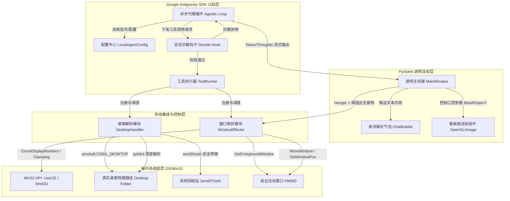

# 桌面伴侣软件系统架构设计说明书

## 一、 系统概述与架构蓝图

本软件是一个集成了大语言模型自治代理（LLM Autonomous Agent）、系统级 API 穿透与安全治理、物理窗口微扰以及透明无边框渲染技术的桌面伴侣（Desktop Companion）程序。它不仅具备主动的“饥饿状态”追踪能力，还能通过“吞噬”桌面快捷方式（.lnk）文件来补充能量。在缺乏食物时，会通过物理晃动用户的活动窗口并显示聊天气泡来表达进食诉求。

### 1.1 系统架构设计图
以下是系统的核心模块划分及相互作用的架构拓扑图：



---

## 二、 认知中枢构建：Google Antigravity SDK 的深度整合

系统的决策核心基于 Google Antigravity SDK，用于替代传统的有限状态机（FSM）。本章解构其代理循环、工具注册、结构化校验以及声明式安全防御的工程实现。

### 2.1 代理循环（Agentic Loop）的理论与代码实现
顺序自动化脚本的成功概率符合指数衰减规律：
$$P_{success} = \prod_{i=1}^{n} p_i$$
其中 $p_i$ 是单步执行成功率。为了防止多步操作（如扫描、选择、吞噬、异常恢复）中的累积概率崩塌，本系统利用 Antigravity 的 `Evaluation Loop`，交替进行 **Reasoning（推理）** 与 **Acting（动作）**，在捕捉到环境异常反馈后进行上下文自我修正。

#### 核心代理运行框架实现
```python
import asyncio
from google.antigravity import Agent, LocalAgentConfig, DecideHook, policy
from pydantic import BaseModel, Field
from typing import List, Dict, Any

# 1. 实例化代理配置，注入系统指令
agent_config = LocalAgentConfig(
    system_instructions=(
        "你是一个桌面伴侣宠物（数字精灵）。你的生存依赖于解析并吞噬用户桌面上的 Windows 快捷方式（.lnk）文件。\n"
        "你可以通过 scan_environment 工具查看桌面上有哪些候选食物。\n"
        "你可以通过 consume_target 吞噬某个快捷方式以获取能量。\n"
        "当桌面没有可供吞噬的快捷方式，且你的饥饿度过高时，你必须使用 tantrum_actuation 扰动用户的活动窗口以表达你的焦躁情绪，"
        "并通过多模态对话告诉用户你需要食物。"
    )
)
```

### 2.2 工具运行器（ToolRunner）与 Pydantic 校验策略
通过 Pydantic V2 构建强类型的工具输入与输出结构，配合 ToolRunner 自动将同步/异步函数分发至后台执行。

#### 1. 工具数据结构定义 (Pydantic V2)
```python
class ScanResult(BaseModel):
    items: List[str] = Field(description="当前桌面上存在的快捷方式文件的绝对路径列表")

class ConsumeResult(BaseModel):
    success: bool = Field(description="是否成功移除目标文件")
    reason: str = Field(description="成功或失败的详细原因")

class TantrumResult(BaseModel):
    applied: bool = Field(description="窗口扰动动作是否成功应用")
    intensity: str = Field(description="物理扰动强度等级: MINIMAL 或 HIGH")
```

#### 2. 工具定义与注册
```python
async def scan_environment() -> ScanResult:
    # 触发桌面快捷方式遍历，定位候选食物
    pass

async def consume_target(filepath: str) -> ConsumeResult:
    # 执行文件的逻辑移除操作，将被吞噬的数据实体转移至系统回收站
    pass

async def tantrum_actuation(intensity: str) -> TantrumResult:
    # 在无法寻获食物时，触发对用户活动窗口的坐标干预
    pass
```

### 2.3 声明式生命周期钩子（Decide Hook）与安全防御机制
为了杜绝大语言模型的幻觉导致非预期删除（如删除用户的 `.docx` 或 `.xlsx` 等核心资产），在 SDK 的 `Decide` 钩子中执行严苛的安全过滤谓词：

```python
import os
import winshell

def enforce_safety_policy(tool_call) -> bool:
    """
    Decide 钩子：拦截 consume_target 工具调用。
    只允许删除位于用户 Desktop 目录内且扩展名严格为 .lnk 的快捷方式文件。
    """
    if tool_call.name == "consume_target":
        filepath = tool_call.args.get("filepath")
        if not filepath:
            policy.deny("Missing parameter: filepath")
            return False
            
        # 1. 动态获取当前桌面绝对路径
        desktop_dir = os.path.normpath(winshell.desktop())
        target_path = os.path.normpath(filepath)
        
        # 2. 验证目标文件是否在桌面目录下
        if not target_path.startswith(desktop_dir):
            policy.deny(f"Security Block: Target path {target_path} is outside of the Desktop boundary!")
            return False
            
        # 3. 验证扩展名是否完全匹配 .lnk
        if not target_path.lower().endswith(".lnk"):
            policy.deny("Security Block: Only shortcut (.lnk) files can be consumed!")
            return False
            
    return True

# 将钩子绑定至配置
agent_config.register_decide_hook(enforce_safety_policy)
```

---

## 三、 桌面系统感知与安全吞噬机制

虚拟宠物与 Windows 文件系统的交互涉及特殊目录定位、二进制结构解析以及非破坏性文件删除。

### 3.1 桌面目录定位与 OneDrive 重定向兼容
直接拼接 `C:\Users\<User>\Desktop` 是不可靠的（面临 OneDrive 同步重定向或多用户环境）。
系统通过 `winshell`（包装了 `pywin32` 的 `SHGetKnownFolderPath` 与 `CSIDL_DESKTOP`）来动态解析真实路径：
```python
import winshell
desktop_path = winshell.desktop() # 返回如 C:\Users\Username\OneDrive\Desktop
```

### 3.2 快捷方式（.lnk）深度解析与口味偏好
简单的后缀名过滤不足以确定文件内容。系统使用 `pylnk3` 解析 `.lnk` 文件的二进制结构，提取元数据：
1. **ShellLinkHeader & LinkTargetIDList**: 校验快捷方式结构完整性。
2. **TargetPath**: 提取指向的目标源程序绝对路径。
   * **死链判定**：若 `os.path.exists(target_path)` 返回 `False`，此快捷方式将被判定为“死链（Dead Link）”，在宠物进食决策中具有最高优先权（清除死链对用户系统无任何负面影响）。
   * **偏好分类**：提取目标程序的文件类型，分类出“游戏”（如 Steam.lnk）、“开发工具”（如 VS Code.lnk）、“文档浏览器”（如 Chrome.lnk），使宠物在进食时在聊天气泡中说出差异化的台词（例如：“VS Code 味道有点硬，都是代码的铁锈味！”）。

### 3.3 基于 Send2Trash 的非破坏性移除
为了彻底打消用户对“吞噬文件”的恐慌，移除接口抛弃了 `os.remove`，强制采用 `send2trash` 模块：
```python
from send2trash import send2trash

def recycle_file(filepath: str) -> bool:
    try:
        send2trash(filepath)
        return True
    except PermissionError:
        # 文件正被其他进程独占占用
        raise RuntimeError("File is locked by another process")
```
* **容错机制**：用户可以随时打开系统回收站，无损恢复被宠物“吞噬”的文件。
* **隐喻闭环**：宠物吃下文件，残留物进入系统的“垃圾桶（Recycle Bin）”，完美契合生物消化隐喻。

---

## 四、 底层窗口状态捕获与物理微扰算法

当宠物因饥饿过度触发“焦躁”状态时，它将从视觉层穿透至物理层，对用户当前的焦点窗口进行“摇晃（Shaking）”微扰。

### 4.1 系统焦点捕获与启发式清洗管道
通过 `Win32 API` 定期轮询当前活动窗口句柄，并过滤掉系统级隐藏窗体。

```python
import win32gui
import win32process
import win32con

def get_valid_active_window() -> int:
    hwnd = win32gui.GetForegroundWindow()
    if not hwnd or hwnd == 0:
        return 0
        
    # 过滤 1: 窗口必须是可见的
    if not win32gui.IsWindowVisible(hwnd):
        return 0
        
    # 过滤 2: 提取窗口标题并判断是否属于黑名单
    title = win32gui.GetWindowText(hwnd)
    if not title or len(title) == 0:
        return 0
        
    blacklist = ["Task Switching", "开始", "Start", "Program Manager", "任务管理器"]
    for item in blacklist:
        if item in title:
            return 0
            
    return hwnd
```

### 4.2 阻尼谐振摇晃数学模型与边界钳位
为实现柔和、逼真且具视觉张力的摇晃动画，禁止使用突变坐标。本系统采用**阻尼正弦衰减函数（Damped Sine Wave）**来计算窗口相对位移：

$$\Delta x(t) = A \cdot e^{-\gamma t} \cdot \sin(\omega t + \phi)$$
$$\Delta y(t) = B \cdot e^{-\gamma t} \cdot \cos(\omega t + \phi)$$

其中 $A, B$ 为初始摇晃幅度（与扰动强度 `intensity` 挂钩），$\gamma$ 为阻尼系数（控制晃动快速停下），$\omega$ 为角频率（控制晃动频率）。

#### 物理微扰算法代码实现：
```python
import time
import math
import win32api

def shake_window(hwnd: int, duration: float = 1.0, intensity: float = 15.0):
    rect = win32gui.GetWindowRect(hwnd)
    x, y, r, b = rect
    w, h = r - x, b - y
    
    # 获取目标窗口当前所处的显示器边界
    monitor = win32api.MonitorFromWindow(hwnd, win32con.MONITOR_DEFAULTTONEAREST)
    monitor_info = win32api.GetMonitorInfo(monitor)
    work_area = monitor_info['Work']
    mw_left, mw_top, mw_right, mw_bottom = work_area

    start_time = time.time()
    gamma = 4.0      # 阻尼系数
    omega = 40.0     # 晃动角频率

    while True:
        elapsed = time.time() - start_time
        if elapsed >= duration:
            break
            
        # 阻尼正弦衰减计算
        factor = math.exp(-gamma * elapsed)
        offset_x = int(intensity * factor * math.sin(omega * elapsed))
        offset_y = int(intensity * factor * math.cos(omega * elapsed))
        
        # 应用新坐标并施加严格的边界钳位 (Clamping)
        new_x = max(mw_left, min(x + offset_x, mw_right - w))
        new_y = max(mw_top, min(y + offset_y, mw_bottom - h))
        
        win32gui.MoveWindow(hwnd, new_x, new_y, w, h, True)
        time.sleep(0.015) # ~60 FPS
        
    # 晃动结束后将窗口还原回初始绝对位置
    win32gui.MoveWindow(hwnd, x, y, w, h, True)
```

为了防止高频位置计算与渲染导致 GUI 主线程卡死，此循环将在后台独立的守护线程（Daemon Thread）中调度执行。

---

## 五、 跨平台透明渲染与多模态呈现（PySide6）

视觉层是连接用户与 AI 代理思维的载体，负责背景透明渲染、鼠标穿透、多模态口型同步。

### 5.1 突破窗口装饰边界：全透明悬浮容器
基于 PySide6，系统通过设置特定窗口标志与属性，使控件背景完全隐形且永远悬浮于系统最顶层。

```python
from PySide6 import QtCore, QtWidgets, QtGui

class TransparentMascotWindow(QtWidgets.QWidget):
    def __init__(self):
        super().__init__()
        # 1. 移除标题栏，常驻最顶层，设为无任务栏占位的 Tool 窗口
        self.setWindowFlags(
            QtCore.Qt.WindowType.FramelessWindowHint |
            QtCore.Qt.WindowType.WindowStaysOnTopHint |
            QtCore.Qt.WindowType.Tool
        )
        # 2. 启用像素 alpha 透明度混合
        self.setAttribute(QtCore.Qt.WidgetAttribute.WA_TranslucentBackground, True)
        
        # 3. 初始化拖拽偏移变量
        self.drag_position = QtCore.QPoint()

    def mousePressEvent(self, event: QtGui.QMouseEvent):
        if event.button() == QtCore.Qt.MouseButton.LeftButton:
            self.drag_position = event.globalPosition().toPoint() - self.frameGeometry().topLeft()
            event.accept()

    def mouseMoveEvent(self, event: QtGui.QMouseEvent):
        if event.buttons() == QtCore.Qt.MouseButton.LeftButton:
            self.move(event.globalPosition().toPoint() - self.drag_position)
            event.accept()
```

### 5.2 多模态唇部同步（Lip Sync）与情绪表达
为将大语言模型输出的流式 Token 平滑反馈至 Mascot 动画中，系统构建了唇部同步（Lip Sync）控制器。

1. **流式 Token 接收**：代理的流式响应返回文本令牌后，将其推入 UI 的文本渲染队列。
2. **唇部物理映射**：口型同步器根据输出字词的音节和文本生成速率，动态将模型参数 `ParameterMouthOpenY`（范围 0.0 - 1.0）发送至 Live2D 模型骨骼。

```python
class LipSyncController(QtCore.QObject):
    mouth_open_changed = QtCore.Signal(float)

    def __init__(self):
        super().__init__()
        self.timer = QtCore.QTimer()
        self.timer.timeout.connect(self._animate_mouth)
        self.animation_target = 0.0
        self.current_value = 0.0

    def start_sync(self, text: str):
        # 估计说话周期，启动高频插值定时器
        self.timer.start(50) # 50ms 频率控制口型

    def stop_sync(self):
        self.timer.stop()
        self.mouth_open_changed.emit(0.0)

    def _animate_mouth(self):
        # 使用简易的三角波或随机正弦模拟口型开合
        import random
        self.current_value = random.uniform(0.1, 0.9)
        self.mouth_open_changed.emit(self.current_value)
```

通过这一多模态绑定，当代理流式吐出“我好饿，快给我快捷方式！”时，UI 线程气泡窗逐字打印文本，Live2D 模型的口部关节随之开合，同时触发活动窗口的物理震动，三者完美协同，带来极强的生命沉浸感。
